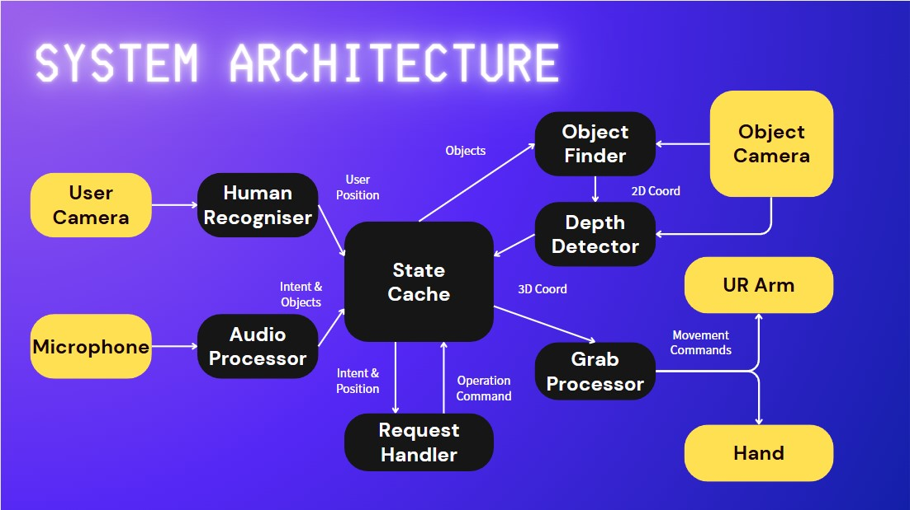

# Proactive Human-Robot Collaborative Service Robot System

**An Interdisciplinary Final-Year Project hosted by the Faculty of Engineering, Hong Kong Polytechnic University.**

Our proposed proactive robot serves Hong Kong elderly people in households. The robot can grab objects and deliver them to the user based on audio commands. As a proof of concept, our robot is currently capable of retrieving four types of medicine, including ACE Inhibitor, Metformin, Atorvastatin, and Amitriptyline.

## About this repository
The deployment scripts includes main.py and all scripts in _modules_ folder. After setting up everything (hardware, SDKs), run _main.py_ directly.

The _legacy_codes_ contains scripts and documents during the development stage and may be outdated and messy. These scripts are unexpected to be called when running the system.

## System Architecture

## Useful Links
HuggingFace Platform: [Deployed Models](https://huggingface.co/collections/borisPMC/household-robot-68062a1be5fca36b8d487b77)

## Pre-Requisites SDKs
1. Windows OS (Preferrably Windows 10)
2. Python 3.11
3. FFMPEG: [Official Website](https://www.ffmpeg.org/download.html)
4. Azure Kinect SDK v1.4.2: [Download Links](https://github.com/microsoft/azure-kinect-sensor-sdk/blob/develop/docs/usage.md)

## Contributors
Yuet Wong 
Son Quang Le 
Jialin Xiao 
Wai Man Lai 
Kit Chuen Leung 
